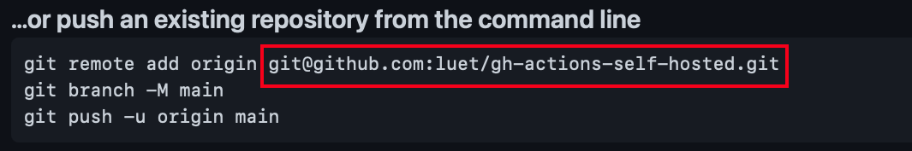

# Table of Contents

1.  [Create a private fork of a public repo](#org2225f8a)
2.  [Configure Actions with self hosted runner](#orgd094744)
3.  [Tmux](#org8f53ef5)


<a id="org2225f8a"></a>

# Create a private fork of a public repo

-   References:
    -   [Create a private fork of a public repository](https://gist.github.com/0xjac/85097472043b697ab57ba1b1c7530274)
    -   [Duplicating a repository - GitHub Docs](https://docs.github.com/en/repositories/creating-and-managing-repositories/duplicating-a-repository)
-   The public repo for this exercise under the `PrincetonUniversity` organization:

    <https://github.com/PrincetonUniversity/gh-actions-self-hosted>

-   Why make a private fork? Risk of someone running malicious code.
-   Create private repo on your own GitHub organization (`luet` in my case):

    <https://github.com/PrincetonUniversity/gh-actions-self-hosted>

    **Screen recording:** [create-private-fork-create-repo-web-site.mp4](http://tigress-web.princeton.edu/~luet/github_actions_tutorial/create-private-fork-create-repo-web-site.mp4)
-   You cannot create a private fork of a public repo from the GitHub web
    interface. You have to do it through the terminal.
-   Create a bare clone:

        $ git clone --bare git@github.com:PrincetonUniversity/gh-actions-self-hosted.git
		
-   Get the URL (ssh) for the new repo on the page where you created the private repo:
    

-   Mirror-push to the new repository.
    
        $ cd gh-actions-self-hosted
        $ git push --mirror [YOUR URL e.g. git@github.com:luet/gh-actions-self-hosted.git]
    
    **Screen recording:** [create-private-fork-command-line-mirror.mp4](http://tigress-web.princeton.edu/~luet/github_actions_tutorial/create-private-fork-command-line-mirror.mp4)


<a id="orgd094744"></a>

# Configure Actions with self hosted runner

-   Go on the GitHub web site for your new, private repo:
    
    -   Reload,
    -   Settings,
    -   Actions,
    -   Configure a Linux self hosted runner.
    
    **Screen recording:** [create-runner-web-site.mp4](http://tigress-web.princeton.edu/~luet/github_actions_tutorial/create-runner-web-site.mp4)
-   Test configuration `.github/workflows/run-test.yml`:
     ```
        name: run-test
        on: [push]
        jobs:
          build:
            runs-on: self-hosted
            steps:
              - uses: actions/checkout@v2
              - name: Run tests 
        	run: salloc -N 1 -n 1 -t 0:10:00 ./test.py
      ```
    -   Here I am using `salloc` but you may need to do part of your test on the
        head node, for instance if you need to compile your code.
    -   Reference:
        -   [Learn GitHub Actions - GitHub Docs](https://docs.github.com/en/actions/learn-github-actions)
        -   [Workflow syntax for GitHub Actions - GitHub Docs](https://docs.github.com/en/actions/learn-github-actions/workflow-syntax-for-github-actions)
-   ssh onto adroit and follow the instructions for setting up the
    runner on adroit. Note: It's best to run in a [Tmux](#org8f53ef5) session.
	
    **Screen recording:** [create-runner-adroit-configure.mp4](http://tigress-web.princeton.edu/~luet/github_actions_tutorial/create-runner-adroit-configure.mp4)
-   Let's make it fail to test:

    **Screen recording:** [testing-runner-make-it-fail-command-line.mp4](http://tigress-web.princeton.edu/~luet/github_actions_tutorial/testing-runner-make-it-fail-command-line.mp4)
-   We can look at some of the logs on the GitHub web site:

    **Screen recording:** [testing-runner-look-at-failed-run-on-web-site.mp4](http://tigress-web.princeton.edu/~luet/github_actions_tutorial/testing-runner-look-at-failed-run-on-web-site.mp4)
-   Tmux:
    -   why: otherwise the runner will be killed when you lose the connection.
    -   action needed:
        -   detach.
        -   rename session.
        -   reatach.
    -   But you will need to restart it once the machine (Adroit in
        this case) is rebooted, for instance during downtime (second
        Tuesday of the month).
        -   There is a way around this using Jenkins and you can contact
            cses@princeton.edu if you would like to set that up.


<a id="org8f53ef5"></a>

# Tmux

-   References:
    -   [A Quick and Easy Guide to tmux](https://www.hamvocke.com/blog/a-quick-and-easy-guide-to-tmux/)
    -   [Tmux Cheat Sheet & Quick Reference](https://tmuxcheatsheet.com/)
-   create new session:
    
        $ tmux
-   rename session (optional but useful if you have multiple sessions):
    
        CTRL+b $
-   detach:
    
        CTRL+b d
-   attach to existing session:
    
        $ tmux a -t gh-runner

**Screen recording:** [tmux.mp4](http://tigress-web.princeton.edu/~luet/github_actions_tutorial/tmux.mp4)

